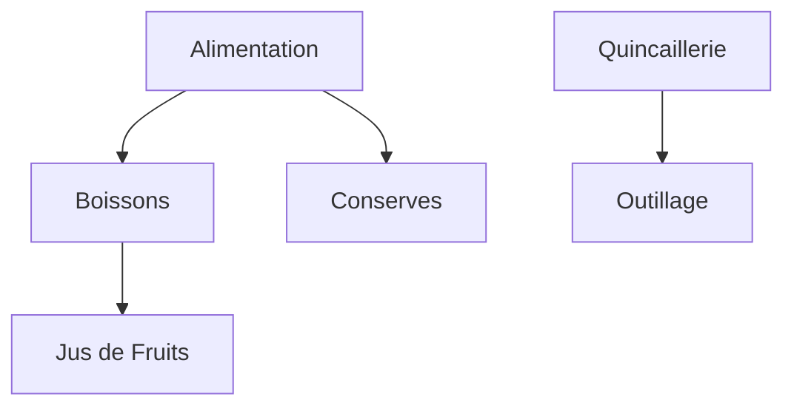
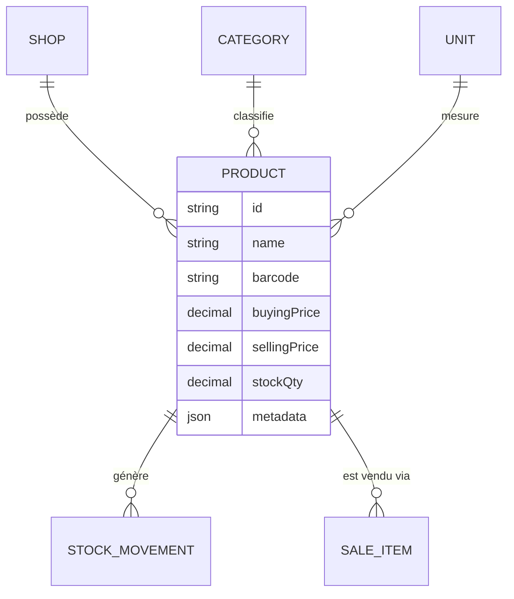
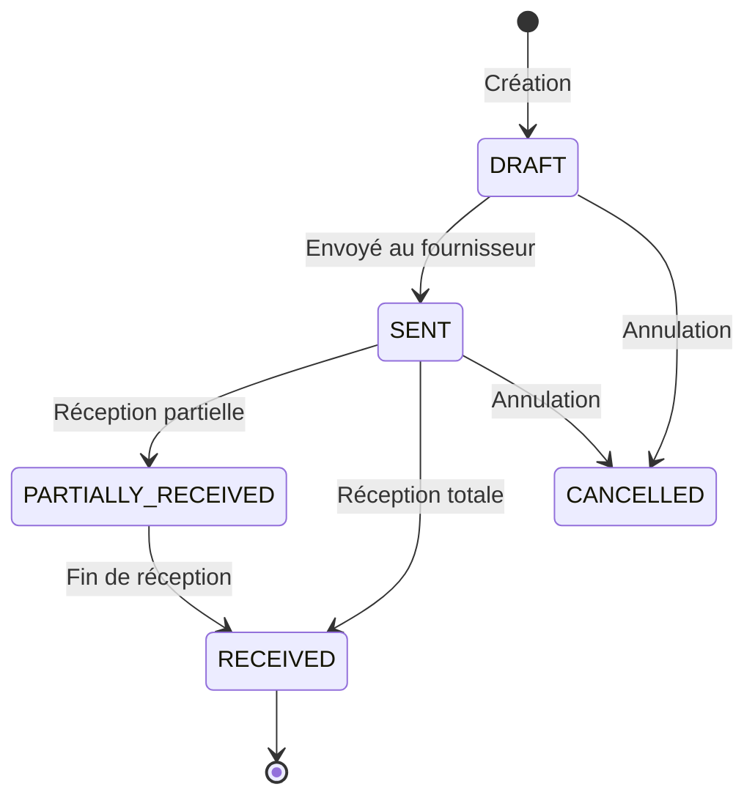
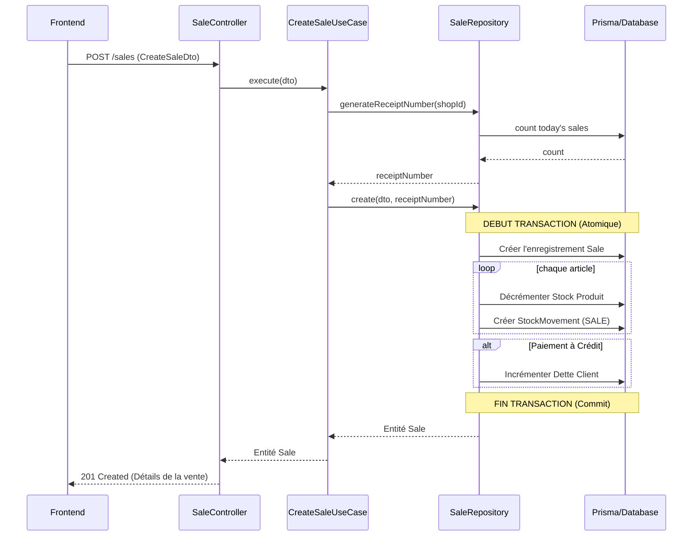
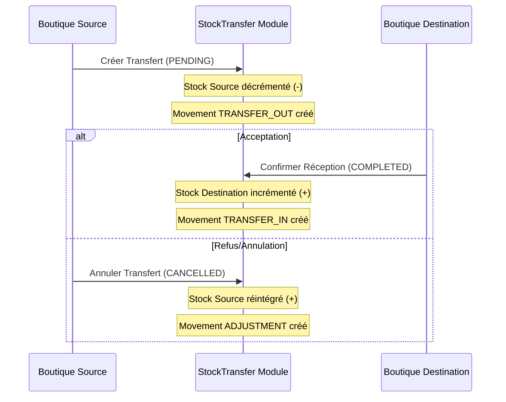
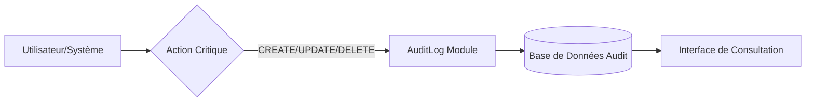

# SP-Services Backend V1.0 🚀
### Gestion de Services - Superette & Quincaillerie

Bienvenue dans le backend de **SP-Services**, une plateforme robuste conçue pour la gestion moderne des commerces multi-boutiques (Superettes, Quincailleries, Dépôts de Gaz, etc.). 

Cette application est construite avec **NestJS** en suivant les principes de l'**Architecture Orientée Domaine (DDD)** pour garantir scalabilité, maintenabilité et robustesse.

---

## 🏗️ Architecture du Projet (DDD)

Le projet respecte une architecture en couches (Clean Architecture / DDD) :

- **Domain Layer** : Contient le cœur métier (Entities, Interfaces de dépôts, Logique pure).
- **Application Layer** : Orchestre les cas d'utilisation (Use Cases) et gère les DTOs.
- **Infrastructure Layer** : Implémentations techniques (Prisma, Cloudinary, etc.).
- **Presentation Layer** : Contrôleurs REST exposant l'API.

---

## 👥 Rôles Utilisateurs & Permissions

Le système gère 5 niveaux d'accès distincts pour assurer une sécurité maximale et une séparation des responsabilités :

| Rôle | Description | Portée |
| :--- | :--- | :--- |
| **SUPER_ADMIN** | Accès total et absolu à l'ensemble du système (tous les shops). | Global |
| **ADMIN** | Accès total à une ou plusieurs boutiques assignées. | Multi-Shops |
| **MANAGER** | Gère les stocks et rapports sur les boutiques assignées. | Multi-Shops |
| **CASHIER** | Utilise l'interface POS pour les boutiques assignées. | Point de Vente |
| **AUDITOR** | Accès en lecture seule sur les boutiques assignées. | Audit |

### Sécurité des accès (ShopAccessGuard) :
Le système utilise un `ShopAccessGuard` qui valide chaque requête. Si un utilisateur tente d'accéder à un `shopId` qui n'est pas dans sa liste d'accès autorisés, le système renvoie une erreur `403 Forbidden`, sauf s'il possède le rôle `SUPER_ADMIN`.

---

## 🏢 Gestion Multi-Boutiques (Shops)

Le système est conçu pour être **Multi-Boutiques**. Contrairement à une structure classique, un utilisateur n'est pas limité à une seule boutique.

### Caractéristiques principales :
- **Accès Multiples (N-à-N)** : Un utilisateur peut être affecté à plusieurs boutiques via la table `UserShopAccess`.
- **Rôles Granulaires** : Possibilité de définir un rôle spécifique par boutique (ex: Admin dans la Boutique A, Auditeur dans la Boutique B).
- **Isolation Dynamique** : Les données restent isolées par `shopId`, mais le système vérifie dynamiquement les permissions de l'utilisateur sur chaque ID demandé.
- **Statut d'activité** : Possibilité d'activer ou désactiver une boutique instantanément.

---

## 📂 Gestion des Catégories (Hiérarchie)

Le module **Category** permet une classification arborescente des produits.

### Fonctionnement Parent/Enfant :


---

## 📏 Gestion des Unités (Units)

Le module **Unit** standardise les mesures pour tout le catalogue.

### Points clés :
- **Standardisation** : Définit les unités (Kg, Litre, Pièce, Carton, etc.).
- **Conversion Visuelle** : Stockage des abréviations (pcs, kg, L) pour les reçus et étiquettes.
- **Impact Inventaire** : Crucial pour les calculs de stock et les ventes au détail.

---

## 📦 Catalogue Produits (Products)

Le module **Product** est le noyau central de l'application. Il lie toutes les entités pour permettre la vente et la gestion de stock.

### Architecture du Produit :


### Logique Métier Avancée :
- **Isolation Critique** : Un code-barres est unique **par boutique**. Cela permet à deux commerces différents d'utiliser le même backend pour leurs propres stocks.
- **Seuils d'Alerte** : Chaque produit possède un `minStockQty`. Le backend expose des endpoints d'alerte pour notifier le frontend des ruptures imminentes.
- **Métadonnées Flexibles** : Le champ `metadata` permet d'ajouter des spécificités métier (ex: type de gaz, poids net, dimensions) sans changer la structure de la base de données.
- **Valorisation du Stock** : Calcul automatique des marges et de la valeur totale du stock.

---

## 📦 Kits & Produits Composés (Product Components)

Le module **ProductComponent** permet de créer des offres groupées ou des produits transformés à partir de composants de base.

### Fonctionnalités :
- **Composition Flexible** : Liez plusieurs produits (composants) à un produit maître (kit).
- **Gestion des Quantités** : Définissez précisément la quantité de chaque composant utilisée dans le kit.
- **Réduction de Stock** : (Prévu) La vente d'un kit peut automatiquement déduire les stocks de ses composants.
- **Transparence** : Visualisation complète de la structure d'un kit pour le frontend.

---

## 📅 Gestion des Lots & Péremption (Product Batches)

Le module **ProductBatch** assure la traçabilité et la sécurité alimentaire/sanitaire du catalogue.

### Fonctionnalités :
- **Suivi par Lot** : Chaque arrivage est identifié par un numéro de lot unique.
- **Gestion des Dates (DLC/DLUO)** : Surveillance automatique des dates d'expiration.
- **Alertes Proactives** : Extraction des lots arrivant à échéance pour éviter les pertes.
- **Coûts Précis** : Permet de suivre le prix d'achat exact de chaque lot pour une comptabilité rigoureuse.

---

## 👥 Gestion des Clients (Customers)

Le module **Customer** centralise la gestion de la relation client et le suivi des balances financières.

### Fonctionnalités Clés :
- **Suivi des Dettes (Balance)** : Monitoring en temps réel de la dette totale (`totalDebt`) pour chaque client.
- **Gestion des Risques** : Définition de plafonds de crédit (`creditLimit`) pour limiter l'exposition financière.
- **Support Offline-First** : Création et modification de clients en mode hors-ligne avec synchronisation intelligente.
- **Fiche Client Complète** : Centralisation des coordonnées (téléphone, email, adresse) et historique des transactions.

---

## 💳 Règlements de Crédits (Credit Payments)

Le module **CreditPayment** gère le recouvrement des dettes et assure l'intégrité des flux financiers.

### Fonctionnalités Clés :
- **Transactions Atomiques** : Chaque règlement met à jour instantanément la dette du client via des transactions de base de données sécurisées.
- **Multi-Modes de Paiement** : Support complet pour les règlements en espèces, Mobile Money (avec référence) et carte bancaire.
- **Traçabilité & Audit** : Archivage précis de chaque versement avec notes explicatives pour un rapprochement comptable facilité.
- **Files d'Attente de Sync** : Les paiements encaissés hors-ligne sont mis en file d'attente et synchronisés dès le retour de la connexion.

---

## 🤝 Gestion des Fournisseurs (Suppliers)

Le module **Supplier** centralise la base de données des partenaires commerciaux pour optimiser la chaîne d'approvisionnement.

### Fonctionnalités Clés :
- **Répertoire de Contact** : Centralisation des coordonnées (nom, contact direct, téléphone, email, adresse).
- **Historique des Approvisionnements** : Liaison directe avec les bons de commande (`PurchaseOrder`).
- **Gestion du Statut** : Activation ou désactivation des fournisseurs pour le filtrage lors des commandes.
- **Notes Stratégiques** : Suivi des particularités de chaque fournisseur (conditions de paiement, délais habituels).
- **Architecture DDD** : Entièrement implémenté selon les principes DDD pour une intégration fluide avec les modules de stock.

---

## 📦 Bons de Commande & Réception (Purchase Orders)

Le module **PurchaseOrder** gère l'approvisionnement des stocks et la traçabilité des entrées de marchandises.

### Cycle de vie d'une Commande :


### Fonctionnalités Clés :
- **Suivi de Statut** : Gestion rigoureuse des états (DRAFT, SENT, PARTIALLY_RECEIVED, RECEIVED, CANCELLED).
- **Réception Intelligente** : Mise à jour automatique du stock physique et du prix d'achat lors de la réception.
- **Traçabilité Totale** : Chaque réception génère un `StockMovement` (PURCHASE) lié au bon de commande pour l'audit.
- **Précision Financière** : Calcul automatique des totaux basés sur les coûts unitaires négociés.
- **Transactions Atomiques** : Garantie de cohérence (soit tout est mis à jour - stock + statut + mouvement - soit rien).

---

## 🏧 Sessions de Caisse (Cash Sessions)

Le module **CashSession** assure le contrôle rigoureux des flux de trésorerie quotidiens et la responsabilité des caissiers.

### Fonctionnalités Clés :
- **Réconciliation de Caisse** : Calcul automatique du solde attendu (`expectedBalance`) basé sur les ventes réelles par rapport au fond de caisse initial.
- **Suivi des Écarts** : Identification immédiate des surplus ou manquants de caisse (`difference`) lors de la clôture pour un audit simplifié.
- **Gestion de la Responsabilité** : Verrouillage logique empêchant un opérateur d'ouvrir plusieurs sessions simultanées, garantissant une traçabilité sans faille.
- **Intégration des Ventes** : Liaison directe de chaque transaction de vente à une session spécifique pour un rapport financier consolidé.

---

## 🛒 Gestion des Ventes (Sales)

Le module **Sale** est le moteur transactionnel central qui orchestre les stocks, les finances et la relation client.

### Fonctionnalités Clés :
- **Paniers Multi-Articles** : Traitement de paniers complexes avec prix unitaires et remises spécifiques par ligne.
- **Paiements Mixtes** : Support de plusieurs modes de règlement (Espèces, Carte, Mobile Money, Crédit) pour une même vente.
- **Synchronisation Atomique du Stock** : Réduction en temps réel des stocks et traçabilité de chaque mouvement via `StockMovement`.
- **Intégration de la Dette** : Mise à jour automatique de la balance client en cas de paiement à crédit.
- **Facturation Intelligente** : Génération de numéros de reçus uniques et normalisés (ex: `VTE-20260510-0001`).

### Flux de Communication d'une Vente :


---

## 🚚 Transferts de Stock (Stock Transfers)

Le module **StockTransfer** gère le mouvement de marchandises entre différentes boutiques du réseau, assurant une traçabilité parfaite et la cohérence des inventaires.

### Fonctionnalités Clés :
- **Flux de Validation en 2 Étapes** : Un transfert est créé en `PENDING` (sortie de stock boutique source) puis confirmé en `COMPLETED` (entrée de stock boutique destination).
- **Auto-Clonage de Produits** : Si un produit transféré n'existe pas encore dans la boutique de destination (recherche par SKU/Barcode), le système le crée automatiquement pour fluidifier le processus.
- **Annulation Sécurisée** : L'annulation d'un transfert réintègre instantanément les produits dans la boutique d'origine avec un mouvement d'ajustement.
- **Traçabilité Multi-Boutiques** : Chaque étape génère des `StockMovement` spécifiques (`TRANSFER_OUT`, `TRANSFER_IN`, `ADJUSTMENT`) liés à l'ID du transfert.

### Cycle de vie d'un Transfert :


---

## 💸 Gestion des Dépenses (Expenses)

Le module **Expense** permet un suivi rigoureux des sorties de trésorerie opérationnelles de chaque boutique (Loyer, Factures, Salaires, etc.).

### Fonctionnalités Clés :
- **Catégorisation Standardisée** : Classification par types (RENT, UTILITIES, SALARY, etc.) pour des rapports financiers précis.
- **Gestion des Récurrences** : Possibilité de marquer des dépenses comme récurrentes avec un jour spécifique du mois.
- **Justificatifs Numériques** : Support pour l'enregistrement d'URLs vers des preuves d'achat ou factures (receiptUrl).
- **Filtrage Avancé** : Analyse des dépenses par boutique, catégorie et période temporelle.
- **Architecture DDD** : Implémentation robuste garantissant une séparation nette entre la logique métier et la persistence Prisma.

---

## ⚙️ Configuration des Boutiques (Shop Settings)

Le module **ShopSetting** permet de personnaliser le comportement et l'apparence de chaque boutique de manière dynamique.

### Fonctionnalités Clés :
- **Clé-Valeur Flexible** : Stockage de paramètres sous forme de paires `key` / `value` (ex: `receipt_footer`, `tax_rate`, `low_stock_threshold`).
- **Groupement Logique** : Organisation des paramètres par groupes (`receipt`, `tax`, `sync`, `display`) pour une gestion simplifiée.
- **Upsert Intelligent** : Un seul endpoint pour créer ou mettre à jour un paramètre, évitant les erreurs de doublons.
- **Support Frontend** : Permet au frontend de charger dynamiquement les configurations spécifiques à la boutique sélectionnée (logo, messages de bienvenue sur les reçus, etc.).
- **Isolation Totale** : Chaque boutique gère ses propres paramètres sans interférer avec les autres boutiques du réseau.

---

## 🛡️ Audit Trail & Traçabilité (Audit Logs)

Le module **AuditLog** est le système de surveillance central qui enregistre toutes les actions critiques effectuées sur la plateforme pour garantir une sécurité et une transparence maximales.

### Fonctionnalités Clés :
- **Capture d'État (Snapshots)** : Enregistre l'état des données avant (`dataBefore`) et après (`dataAfter`) chaque modification, permettant un retour en arrière ou une analyse précise des erreurs.
- **Contexte Complet** : Chaque log capture l'auteur de l'action, la boutique concernée, l'adresse IP et l'agent utilisateur (navigateur/appareil).
- **Actions Supervisées** : Suit les créations, mises à jour, suppressions, connexions/déconnexions, annulations de ventes, changements de prix et ajustements de stock.
- **Filtrage Multidimensionnel** : Recherche puissante par période, utilisateur, type d'entité (ex: "Product", "Sale") ou action spécifique.

### Architecture de l'Audit :


---

## 🛠️ Stack Technique

- **Framework** : [NestJS](https://nestjs.com/) (Node.js)
- **Langage** : TypeScript
- **ORM** : [Prisma](https://www.prisma.io/)
- **Base de Données** : PostgreSQL
- **Documentation** : Swagger / OpenAPI

---

## 🚀 Installation & Démarrage

```bash
npm install
npx prisma generate
npx prisma db push
npm run start:dev
```

---

## 📝 Documentation API
Une fois le serveur lancé, accédez à Swagger : `http://localhost:3001/api/v1/docs`