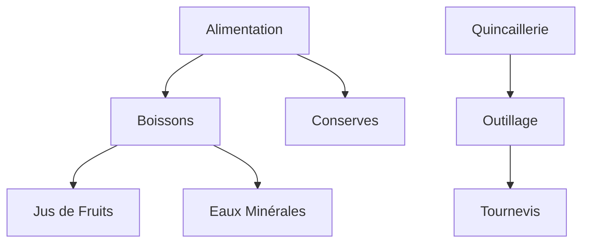

# SP-Services Backend V1.0 🚀
### Gestion de Services - Superette & Quincaillerie

Bienvenue dans le backend de **SP-Services**, une plateforme robuste conçue pour la gestion moderne des commerces multi-boutiques (Superettes, Quincailleries, Dépôts de Gaz, etc.). 

Cette application est construite avec **NestJS** en suivant les principes de l'**Architecture Orientée Domaine (DDD)** pour garantir scalabilité, maintenabilité et robustesse.

---

## 🏗️ Architecture du Projet (DDD)

Le projet respecte une architecture en couches (Clean Architecture / DDD) :

- **Domain Layer** : Contient le cœur métier (Entities, Interfaces de dépôts, Logique pure).
- **Application Layer** : Orchestre les cas d'utilisation (Use Cases) et gère les DTOs.
- **Infrastructure Layer** : Implémentations techniques (Prisma, Cloudinary, etc.).
- **Presentation Layer** : Contrôleurs REST exposant l'API.

---

## 👥 Rôles Utilisateurs & Permissions

Le système gère 5 niveaux d'accès distincts pour assurer une sécurité maximale et une séparation des responsabilités :

| Rôle | Description | Portée |
| :--- | :--- | :--- |
| **SUPER_ADMIN** | Accès total et absolu à l'ensemble du système. | Global (Toutes les boutiques) |
| **ADMIN** | Administrateur de sa propre boutique. | Boutique Spécifique |
| **MANAGER** | Gère les stocks, les achats et les rapports quotidiens. | Boutique Spécifique |
| **CASHIER** | Utilise l'interface POS pour les ventes uniquement. | Point de Vente |
| **AUDITOR** | Accès en lecture seule pour l'audit et le contrôle. | Boutique Spécifique |

---

## 🏢 Gestion Multi-Boutiques (Shops)

Le système est conçu pour être **Multi-Boutiques**. Chaque boutique est une entité isolée avec ses propres configurations, stocks et personnels.

### Caractéristiques principales :
- **Isolation des données** : Les produits, ventes et utilisateurs sont rattachés à une boutique spécifique.
- **Paramètres personnalisés** : Chaque boutique définit sa devise (ex: XOF), ses taxes et son logo.
- **Statut d'activité** : Possibilité d'activer ou désactiver une boutique instantanément.
- **Audit indépendant** : Les journaux d'audit sont filtrés par boutique pour une traçabilité précise.

---

## 📂 Gestion des Catégories (Hiérarchie)

Le module **Category** utilise une structure auto-référencée permettant de créer une arborescence infinie de catégories et sous-catégories.

### Fonctionnement Parent/Enfant :
- **Catégorie Parente** : Une catégorie racine (ex: "Alimentation").
- **Catégorie Enfant (Sous-catégorie)** : Une catégorie rattachée à un parent (ex: "Boissons" rattaché à "Alimentation").
- **Héritage** : Un enfant peut lui-même devenir parent d'autres sous-catégories (ex: "Jus" rattaché à "Boissons").



**Caractéristiques techniques :**
- `colorHex` : Personnalisation de la couleur pour l'affichage sur le POS.
- `iconName` : Icône descriptive pour une navigation visuelle rapide.

---

## 🛠️ Stack Technique

- **Framework** : [NestJS](https://nestjs.com/) (Node.js)
- **Langage** : TypeScript
- **ORM** : [Prisma](https://www.prisma.io/)
- **Base de Données** : PostgreSQL
- **Documentation** : Swagger / OpenAPI
- **Sécurité** : JWT (Passport), BcryptJS, Helmet

---

## 🚀 Installation & Démarrage

### Configuration
1. Clonez le dépôt.
2. Copiez le fichier `.env.example` en `.env` et configurez vos variables.
3. Installez les dépendances :
```bash
npm install
```

### Base de données
```bash
npx prisma generate
npx prisma db push
```

### Exécution
```bash
# Développement (Watch mode)
npm run start:dev

# Production
npm run build
npm run start:prod
```

---

## 📝 Documentation API
Une fois le serveur lancé, la documentation interactive Swagger est disponible à l'adresse :
`http://localhost:3000/api/docs` (ou le port configuré).

---

## 🛡️ License
Ce projet est sous licence propriétaire. Tous droits réservés.